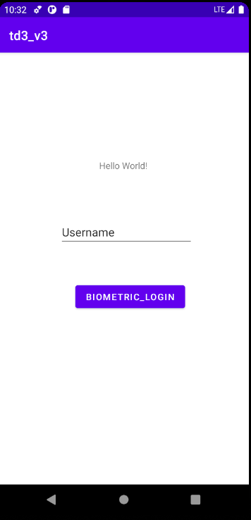
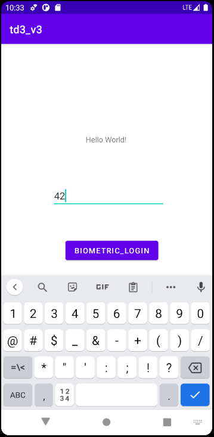
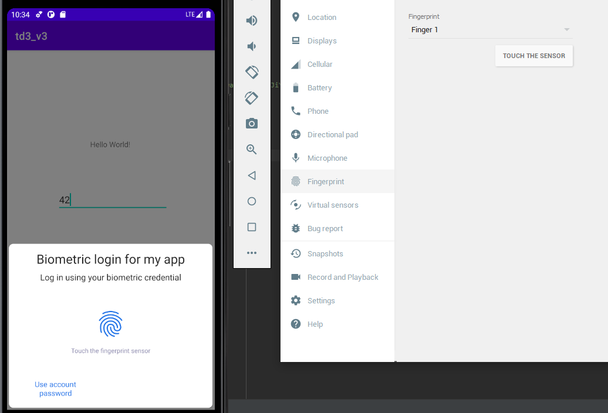
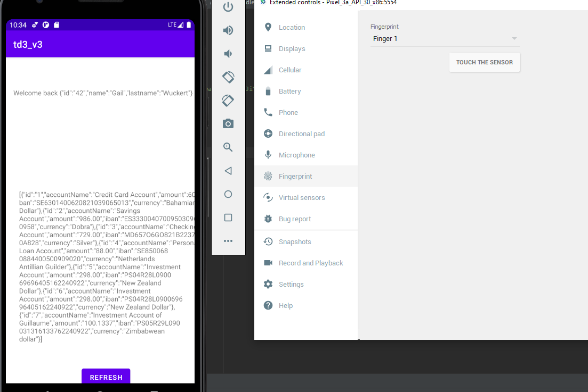

# td3_mobile

- Explain how you ensure user is the right one starting the app
When you start the app, you can select your username and connect using the button. On clicking, a biometric login
pop up so only the phone's owner can access the accounts

- How do you securely save user's data on your phone ?
To make the app accessible offline, we have a file that saves the bank accounts that should be only accessible 
by the app.

- How did you hide the API url ?
To hide the API url, I used Base64 encoding.

- Screenshots of your application

